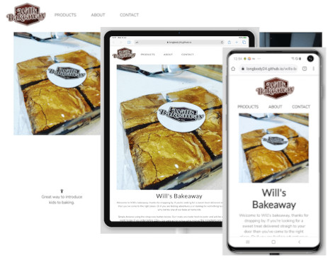
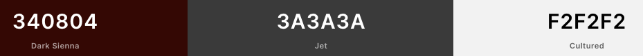

# Will's Bakeaway

Deployed Website URL - https://longbody24.github.io/wills-bakeaway/

## INTRODUCTION
Will's Bakeaway is a start up business (Set up by my cousin Will) selling both ready made brownies along with pre measured baking kits with easy to follow instructions for customers to try themselves at home or get little ones involved in baking for the first time. The Website will give the business an online prescence and enable customers to see exactly what kind of products are avaialble to them and with a little bit information about the company within the About Us page and links to social channels.

Clear signposting will enable customers to get in contact with any questions and the site is responsive to allow customers to have a good user experience accross Mobile, Tablet and Desktop.

## USER EXPERIENCE

### User Stories
- #### As a new visitor seeing the site for the first time:
   1. I want to easily understand the purpose and layout of the site.
   2. Be able to intuitively navigate the site to browse all content.
   3. Learn more about the business from a decicated page.
   4. If I have any questions be able to find contact details easily.
   5. Be able to view all products available.
   6. Be able to drill down into individual products.
   7. Easily connect with the business via social media channels.
   8. Clear product photography to help me in the buying process.

- #### As a returning customer
   1. Be able to use the website on any device for my convenience whether i'm at home on my laptop or commuting to work on my mobile.
   2. I want the product information to be clear and laid out in a way that i'm not left with any questions.
   3. Site Navigation should be available at all times so I can easily navigate from one page to another.

WIth these user stories alongside my extensive experience of working in an E-commerce fashion website. I have tried to implement a slick easy to use customer experience.

## DESIGN

### Color Scheme
* Have tried to keep the site relatively clean using only 3 colors the dark brown of the company Logo, a dark grey for the text and then a soft white for backgrounds and buttons and a a font contrast color.

I have run the site through [WaveWebAccessibility](https://wave.webaim.org/) and no contrast issues were picked up.

 

### Typography
* The main body font i chose was 'Nunito' with a sans-serif fallback.
* The secondary font used for buttons was 'Lato' a sans-serif fallback.

### Images
* Strong product images were chosen to really sell the product to the use. All images were optimised by running through [tinyPNG](https://tinypng.com/) to ensure site speed was not impacted.
* FREE icons for the benefit bar were sourced from [FontAwesome](https://fontawesome.com/) to add a bit more clarity to each benefit.

### Wireframes
* All wireframes were produced using AdobeXD although close to the final design there were some tweak alongs the design process.
[LaptopWireframes]()
[MobileWireframes]()
[TabletWireframes]()

### Responsiveness
* All pages have been designed responsively to behave correctly no matter the design. On smaller mobile devices I decided to hide on of the main hero images to ensure the page depth was not too long.

## SITE FEATURES

### Site Wide Header Navigation
* Site wide responsive header navigation. Includes logo for brand consistency as well as links to Products, About Us and Contact us landing pages.
* Active Page has an active class so the user knows where they are.
* When hovering over a link the font color changes to green to highlight the fact it is a link
* Simple design for customers to navigate the site easily without having to use the default browser back button.
* Favicon also included to display logo on the browser tab along side the page title to enforce brand identity

### Site Wide Footer Navigation
* Social links to drive customers to social pages to follow, these will open in a new page so that Will's Bakeaway remains open.
* Added aria labels for accessibility
* Simple benefit bar with icons to sell the benefits of the business, viewable accross the site. Static copy no links required

### Home Page
*  Simple hero images and introducton copy with strong CTA to get customers into the shopping part of the site.
*  Site full width to push the strong imagery

### Products Page
* Intro copy to give further information and also important for SEO.
* 6 products displayed with clear photography, product title and price with obvious button to link through to get the full details of the prouduct. Reponsive so that products will wrap onto next line and finally into a column on smaller devices.

### Product Details Page
* Clear product image to whet the customers appetite
* Simply laid out product details to give customers good understanding of what they can expect on ordering.
* Dual navigation buttons so that if an item is SOLD OUT they can easily return to the BAKES page to carry on shopping.
* Phone number and Email Address are clearl positioned in case the custome has any questions and needs to get in contact.
* Responsive will switch to column on smaller devices

### Contact Us
* Simple form for customers to be able to submit any queries they may have.
* Validated Form. Email Address & Message are required fields to be able to submit the message. (used the form dump link from the forms module on the couse.)
* Phone no. clearly displayed in case customers do not want to email.

## Technologies Used

### Languages Used

* [HTML5](https://en.wikipedia.org/wiki/HTML5)
* [CSS3](https://en.wikipedia.org/wiki/Cascading_Style_Sheets)

### Tools & Programs Used
* [Font Awesome](https://fontawesome.com/) - Font Awesome was used to add social icons and complement the design.
* [Google Fonts](https://fonts.google.com/) - Google Fonts was used to import 'Exo' and 'PT Sarif' fonts in the main.css stylesheet.
* [Git](https://git-scm.com/) - Git was used to allow for tracking of any changes in the code and for the version control.
* [GitPod](https://www.gitpod.io/) - GitPod, connected to GitHub, hosted the coding space and allowed the projected to be committed to the Github repository.
* [Github](https://github.com/) - GitHub is used to host the project files and publish the live website by using Git Pages.
* [Adobe Xd](https://www.adobe.com/ie/products/xd.html) - Adobe Xd was used to create wireframes.
* [TinyJPG](https://tinyjpg.com/) - TinyJPG was used to lower the resolution of the images.
* [Gimp](https://www.gimp.org/) - Gimp Image manipuation program used for resizing images.

## TESTING
Throghout the project I used a number of resources and tools to help me along my way. Starting with google dev tools to make alterations on the fly before hard coding into gitpod and commiting. I also shared my site with one of my peers who recentlty qualified from his course and he pointed out a few minor tweaks to pick up on, mainly around how the site behaved responsively at a very specific size. In addition I did request on slack a peer review but as yet have had no feedback.

### Responsive Testing
* Site was tested physically on iPad, Samsung Note 8+, Macbook Air 2012, iPhone 6, iPhone 8 and on a larger monitor 21 inches.
* In addition I spent alot of time using [Responsinator](https://www.responsinator.com/) to try as many devices and variations as possible.
* I also used a free trial of [Browserstack](https://live.browserstack.com/) which i have previously used for QA testing in a previous role.

### Validator Testing
* HTML
    * All html was run through [ValidatorW3](https://validator.w3.org/) Some minor code issues were raised and corrected then rerun until no errors were passed.

* CSS
    * All CSS was run through [jigsaw.w3.org](https://jigsaw.w3.org/css-validator/) No errors were passed.

### Accessibility Testing
* Site run through [WaveWebAccessibility](https://wave.webaim.org/) any errors corrected and retested.

### Bugs
* Embedding a reponsive youtube video has proven tricky, I have had to inplement a bit of a fudge managing the video size at various breakpoints rather than be truly reponsive. Tried various solutions found on Google & Slack but as of yet not joy.

### Future Releases
* Obviously the ability to shop directly from the site is imperative so a full ecommerce checkout would be top of the list.
* Product Slideshows. Again product photography is king to sell the product to the customer. I did look into slideshows etc but it appeared that the majority of solutions required Javascript which I have not yet covered off in the course.
* HP Slideshow - As above to show off more brand content to keep the customers interest
* Instagram Feed - To help keey site content fresh
* Live Chat - Another useful feature to help customers convert.

## DEPLOYMENT

Publishing LIVE version of site.

1. Go to the remote repository at https://github.com/longbody24/wills-bakeaway hosted by GitHub
2. Click "Settings"
3. In "GitHub Pages", select a publishing source (master branch in the drop-down menu)
4. The site is now published at https://longbody24.github.io/wills-bakeaway/

## CREDITS

### Media
* All images were provided by Mr Will Dixon of Will's Bakeaway.
* Video taken from Will's Bakeaway Youtube channel [WillsBakeawayYoutube](https://www.youtube.com/channel/UCC8cfy3aebdaWS8tiZFS5ow)

### Content
* All written copy written by myself Jamie Cotton, product information provided by Will Dixon of Wills Bakeaway.
* Footer Icons taken from [FontAwesome](https://fontawesome.com/)

### Code
* Flexbox influence taken from [CssTricks](https://css-tricks.com/snippets/css/a-guide-to-flexbox/)
* Alongside using Slack as a resource. Some of the key sites that I used were:
    * [w3schools](https://www.w3schools.com/)
    * [StackOverflow](https://stackoverflow.com/)
    * [FreeCodeCamp](https://www.freecodecamp.org/news/)
    * [CSSTricks](https://css-tricks.com/)
